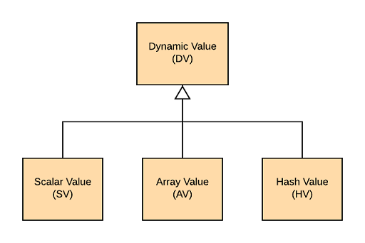

# dtl_type

A dynamic type system for the C programming language.

## What is it?

A Dynamically Typed Language (or DTL) is a generic term for a modern scripting language such as Python, Perl or Javascript.
Such languages usually contains many parts:

* Language syntax
* Compiler
* Runtime Interpreter (or Virtual Machine)
  * Type system
* Language Libraries

In dtl_type I have implemnted just the type system without any of the other language components. It is inspired by the Perl type system and uses similar terminology.

Using this library you can easily build arbitrarily complex data structures in runtime using the C programming language.
All values are reference counted which significantly simplifies memory management. The initial reference count of newly created values is 1.

Some programming languages (or libraries) might provide a special kind of data type called *Variant*, this library offers a similar solution for the C programming language.

## Where is it used?

* [cogu/dtl_json](https://github.com/cogu/dtl_json)
* [cogu/c-apx](https://github.com/cogu/c-apx)

This repo is a submodule of the [cogu/c-apx](https://github.com/cogu/c-apx) (top-level) project.

## Dependencies

* [cogu/adt](https://github.com/cogu/adt)
* [cogu/cutil](https://github.com/cogu/cutil)

The unit test project(s) assume that the repos are cloned side-by-side to a common directory as seen below.

* adt
* cutil
* dtl_type (this repo)

### Git Example

```bash
cd ~
mkdir repo && cd repo
git clone https://github.com/cogu/adt.git
git clone https://github.com/cogu/cutil.git
git clone https://github.com/cogu/dtl_type.git
cd dtl_type
```

## Related projects

The [cogu/dtl_json](https://github.com/cogu/dtl_json) project provides JSON serialization and deserialization routines based on the dtl_type system.

## Building with CMake

First clone this repo and its dependencies into a common directory (such as ~/repo) as seen above. Alternatively the repos can be submodules of a top-level repo (as seen in [cogu/c-apx](https://github.com/cogu/c-apx)).

### Running unit tests (Linux)

Configure:

```sh
cmake -S . -B build -DUNIT_TEST=ON
```

Build:

```sh
cmake --build build --target dtl_type_unit
```

Run test cases:

```cmd
cd build && ctest
```

### Running unit tests (Windows with Visual Studio)

Use a command prompt provided by your Visual Studio installation.
For example, I use "x64 Native Tools Command Prompt for VS2019" which is found on the start menu.
It conveniently comes with CMake pre-installed which generates Visual Studio projects by default.

Configure:

```cmd
cmake -S . -B VisualStudio -DUNIT_TEST=ON
```

Build:

```cmd
cmake --build VisualStudio --config Debug --target dtl_type_unit
```

Run test cases:

```cmd
cd VisualStudio && ctest
```

## Usage

``` C
#include <stdio.h>
#include <stdlib.h>
#include "dtl_type.h"
#include "adt_str.h"

int main(int argc, char **argv)
{
   int i;
   dtl_sv_t *sv;

   /*** Scalar values ***/
   dtl_sv_t *sv1 = dtl_sv_make_i32(125);
   dtl_sv_t *sv2 = dtl_sv_make_cstr("Hello World");
   dtl_sv_t *sv3 = dtl_sv_make_dbl(10.2);

   printf("%d\n", dtl_sv_to_i32(sv1, NULL));
   printf("%s\n", dtl_sv_to_cstr(sv2));
   printf("%f\n", dtl_sv_to_dbl(sv3, NULL));
   printf("\n");

   /*** Array Values ***/
   dtl_av_t *av = dtl_av_new();
   dtl_av_push(av, (dtl_dv_t*) sv1, true);
   dtl_av_push(av, (dtl_dv_t*) sv2, true);
   dtl_av_push(av, (dtl_dv_t*) sv3, true);
   //reference count for sv1, sv2 and sv3 are now set to 2

   /*** Printing Array Values***/
   for (i = 0; i < dtl_av_length(av); i++)
   {
      sv = (dtl_sv_t*) dtl_av_value(av, i);
      const char *cstr = dtl_sv_to_cstr(sv);
      printf("%s\n", cstr );
   }
   dtl_dec_ref(av); //deletes av. Reference count for sv1, sv2 and sv3 is now 1
   printf("\n");

   /*** Hash Values ***/
   dtl_hv_t *hv = dtl_hv_new();
   dtl_hv_set_cstr(hv, "first", (dtl_dv_t*) sv1, true);
   dtl_hv_set_cstr(hv, "second",(dtl_dv_t*) sv2, true);
   dtl_hv_set_cstr(hv, "third", (dtl_dv_t*) sv3, true);
   //reference count for sv1,sv2 and sv3 is now 2

   const char *key;
   dtl_hv_iter_init(hv);
   while ( (sv = (dtl_sv_t*) dtl_hv_iter_next_cstr(hv, &key)) )
   {
      sv = (dtl_sv_t*) dtl_hv_get_cstr(hv, key);
      printf("%s: %s\n", key, dtl_sv_to_cstr(sv));
   }
   dtl_dec_ref(hv); //deletes hv
   //reference count for sv1, sv2 and sv3 is now 1

   /*** cleanup ***/
   dtl_dec_ref(sv1); //deletes sv1 (reference count -> 0)
   dtl_dec_ref(sv2); //deletes sv2 (reference count -> 0)
   dtl_dec_ref(sv3); //deletes sv3 (reference count -> 0)

   return 0;
}
```

## Dynamic Value (DV)

This is the base class which all other value types inherits from. (This is a pseudo-statement since C have neither classes or inheritance-)

A dynamic value can be any of the following types:

* Scalar Value (SV)
* Array Value (AV)
* Hash Value (HV)



## Scalar Values (SV)

A scalar contains a single unit of data.

Example of scalar types:

* Integer
* Double
* String
* Boolean
* NoneType (this name is actually borrowed from Python)

## Array Values (AV)

Array values are managed arrays containing dynamic values (DVs).

Examples:

* Array of scalar values
* Array of array values
* Array of hash values
* Array of mixed values (any of the above)

## Hash Values (HV)

Hash values are key-value lookup tables where the key is a string and the value is any dynamic value (DV).
